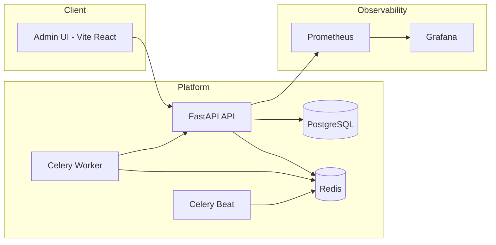

# Subscription Billing & Payments System

A pragmatic, production-oriented billing stack: FastAPI + PostgreSQL + Redis + Celery + Vite/React admin UI. Deployed on Railway.

**Live Admin UI:** `https://static-production-518e.up.railway.app`  
**Status:** API/Workers healthy; scheduled billing via Celery Beat; dashboards via Grafana.

---

## 1) Background

SaaS products need predictable, automated billing with strong correctness guarantees (idempotent charges, clear proration rules, and defensible audit history). This project implements the core building blocks to run real billing operations without vendor lock‑in, while staying small enough to reason about.

---

## 2) Architecture (at a glance)



**Why this shape works**

- **FastAPI** for a lean, async control plane (users, plans, subscriptions, invoices).  
- **PostgreSQL** as the ledger-of-record with strong constraints and clear lifecycle.  
- **Redis** for low-latency cache + Celery broker/backpressure.  
- **Celery worker/beat** for asynchronous invoice generation and retries.  
- **Vite/React** admin UI to manage plans, subscriptions, invoices, and payments.

---

## 3) Requirements (MoSCoW)

**Must**

- Create users, plans, and subscriptions; support upgrades/downgrades and trials.
- Track usage (e.g., API calls) and generate invoices with clear line items.
- Idempotent payments; safe retries; auditable subscription/invoice history.
- Health endpoints and basic metrics (latency, retries, throughput).

**Should**

- Proration for mid-cycle plan change.
- Usage tiers (e.g., first 100k free, then per‑unit).
- Admin UI for invoices, payments history, plan catalog.

**Could**

- Webhook handler for Stripe events.
- Rate-limited usage ingestion endpoints.
- Service tokens for programmatic producers of usage.

**Won’t (for MVP)**

- Multi‑currency + tax engine.
- Revenue recognition/GL export.

---

## 4) Method

### Domain model (tables)

- `users(id, email, created_at)`  
- `plans(code, name, amount_cents, interval, trial_days)`  
- `subscriptions(id, user_id, plan_code, status, current_period_start, current_period_end)`  
- `usage(id, user_id, metric, quantity, recorded_at)`  
- `invoices(id, user_id, period_start, period_end, amount_cents, status, created_at, paid_at)`  
- `invoice_lines(invoice_id, kind, description, amount_cents)`  

**Key rules**
- Only **API** writes mutate state; workers use transactions + idempotency keys.  
- Invoices are **immutable** once paid; adjustments create follow-up credit/debit notes.  
- Usage is append‑only; aggregation happens in workers at invoice generation time.

### Algorithms (high level)

- **Invoice generation**: group usage by period and price tier; add plan base fee; create lines; mark invoice `open`.
- **Payment**: create a payment intent; confirm; idempotency on `(invoice_id, gateway_txn_id)`; on success set `paid_at` and `status=paid`.
- **Plan change**: close current period, compute pro‑rata delta, open new period at new plan.

---

## 5) Implementation

- **API**: FastAPI with `asyncpg` and Pydantic schemas.  
- **Workers**: Celery 6.x; Redis broker; exponential backoff for gateway retries.  
- **Storage**: Postgres 16 with strict FKs + indexes on `(user_id, created_at)` and usage `(user_id, metric, recorded_at)`.
- **Caching**: Redis for hot plan metadata + usage counters.  
- **Deployment**: Railway (API & workers from repo Dockerfiles; Redis/Postgres managed services; static UI deployed as a static site).

---

## 6) Load test snapshot (Railway prod)


**Interpretation**

- Headroom up to ~**1.4k req/s sustained** at ~**200** concusers with **p95 ≈ 380 ms**.  
- Throughput flattens due to Postgres connection caps + Redis round‑trips.  
- Errors remain near zero until 100+ concusers; at 200, rate‑limits/backpressure kick in.

**Next optimizations**

- Add PgBouncer; lift pool size; batch usage writes.  
- Cache plan catalog for 5–10 min; collapse identical reads with single-flight.  
- Pre‑aggregate usage by minute in Redis; flush in worker batches.

---

## 7) Debugging story 

**Symptom**: API crashed on Railway with `psycopg2` import errors.  
**Root cause**: DSN used `postgresql+asyncpg://` but the first import path in SQLAlchemy attempted `psycopg2`.  
**Fix**: Pin `asyncpg` and ensure `create_async_engine` is used everywhere; validate the `DATABASE_URL` at boot and log the parsed driver. Also added a startup `/healthz` that checks DB connectivity to fail fast.

A later deploy failed with *“Dockerfile not found”* for worker/beat. The root cause was the service **Root Directory** pointing at the repo root, while Dockerfile lived under `/worker`. We fixed it by setting the service Root Directory to `/worker` and using a minimal Dockerfile that `COPY worker/app ./app`—and confirmed it with a green build.

---

## 8) Ops & URLs

- **Admin UI**: https://static-production-518e.up.railway.app  
- **API**: `/healthz`, `/plans`, `/users`, `/subscriptions`, `/usage`, `/invoices`  
- **Readiness**: worker logs show `celery@… ready`; beat logs show `beat: Starting…`

---

## 9) Trade‑offs & constraints

- **Vendor neutral core** (Postgres/Redis) with optional **Stripe** integration → easy to swap gateways.  
- **Celery** keeps async simple; not as elastic as serverless, but predictable and cheap.  
- **Relational ledger** over event store for clarity; can emit events later for analytics.

---

## 10) Milestones

1. ✅ CRUD for users/plans/subscriptions; usage ingest; invoice generation.  
2. ✅ Admin UI: plans, invoices, payments history.  
3. ✅ Railway deploy: API, worker, beat, static UI, Postgres, Redis.  
4. ⏭ Stripe webhooks + retries; PgBouncer; dashboards.

---

## 11) Getting started (local)

```bash
docker compose up -d postgres redis
docker compose up -d api worker celery-beat
# UI
docker compose run --rm -p 5173:5173 web sh -c "npm install && npm run dev -- --host 0.0.0.0"
```

---

## 12) License

MIT
